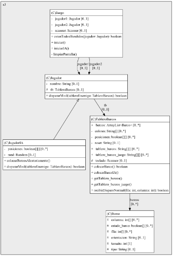

                                                         System.out.println(BATTLESHIP);
                                                                       
                                                                       __/___            
                                                                 _____/______|           
                                                         _______/____\_______\_____     
                                                         \               < < <       |   
                                                       ~~~~~~~~~~~~~~~~~~~~~~~~~~~~~~~~~~~

El juego consiste en el tradicional juego de hundir la flota en el que 2 jugadores colocan su armada en un tablero, en este caso de 8x8, y disparan ciegamente al tablero rival hasta que uno de los jugadores derribe todos los barcos rivales.
En un principio se pensó en hacer un segundo tablero para cada jugador en el que se colocarían submarinos y serían disparados por torpedos que barrerían toda una fila.
También se ha considerado implementar un misil de área 3x3 casillas que se desbloqueara una vez se derribe el barco rival más pequeño, el códico de este quedó a medias.
Se ha añadido adicionalmente una "inteligencia artificial" contra la que jugar a la que se ha implementado una función Random para que este jugador coloque sus barcos en el tablero de manera aleatoria, respetando el tamaño y orientación de estos e impidiendo que ponga varios barcos en el mismo lugar.
El código funciona de la siguiente manera:
Al iniciar una partida en el método Main se seleccionará la cantidad de jugadores "reales" de la partida.
Tras ello cada jugador colocará sus barcos en su tablero.
Una vez colocados ambos jugadores comenzarán a lanzar misiles ciégamente al tablero rival de manera alterna hasta que uno de ellos derribe toda la flota de su rival.
El código cubre todo tipo de errores en cuanto a introducir el valor correcto de la horientación o fila, no poder repetir la posición de lanzamiento de un misil, no colocar barcos ni lanzar misiles fuera del tablero...

El diagrama de clases UML tendría el siguiente código:
@startuml

/' diagram meta data start
config=StructureConfiguration;
{
"projectClassification": {
"searchMode": "OpenProject", // OpenProject, AllProjects
"includedProjects": "",
"pathEndKeywords": "*.impl",
"isClientPath": "",
"isClientName": "",
"isTestPath": "",
"isTestName": "",
"isMappingPath": "",
"isMappingName": "",
"isDataAccessPath": "",
"isDataAccessName": "",
"isDataStructurePath": "",
"isDataStructureName": "",
"isInterfaceStructuresPath": "",
"isInterfaceStructuresName": "",
"isEntryPointPath": "",
"isEntryPointName": "",
"treatFinalFieldsAsMandatory": false
},
"graphRestriction": {
"classPackageExcludeFilter": "",
"classPackageIncludeFilter": "",
"classNameExcludeFilter": "",
"classNameIncludeFilter": "",
"methodNameExcludeFilter": "",
"methodNameIncludeFilter": "",
"removeByInheritance": "", // inheritance/annotation based filtering is done in a second step
"removeByAnnotation": "",
"removeByClassPackage": "", // cleanup the graph after inheritance/annotation based filtering is done
"removeByClassName": "",
"cutMappings": false,
"cutEnum": true,
"cutTests": true,
"cutClient": true,
"cutDataAccess": true,
"cutInterfaceStructures": true,
"cutDataStructures": true,
"cutGetterAndSetter": true,
"cutConstructors": true
},
"graphTraversal": {
"forwardDepth": 3,
"backwardDepth": 3,
"classPackageExcludeFilter": "",
"classPackageIncludeFilter": "",
"classNameExcludeFilter": "",
"classNameIncludeFilter": "",
"methodNameExcludeFilter": "",
"methodNameIncludeFilter": "",
"hideMappings": false,
"hideDataStructures": false,
"hidePrivateMethods": true,
"hideInterfaceCalls": true, // indirection: implementation -> interface (is hidden) -> implementation
"onlyShowApplicationEntryPoints": false, // root node is included
"useMethodCallsForStructureDiagram": "ForwardOnly" // ForwardOnly, BothDirections, No
},
"details": {
"aggregation": "GroupByClass", // ByClass, GroupByClass, None
"showClassGenericTypes": true,
"showMethods": true,
"showMethodParameterNames": true,
"showMethodParameterTypes": true,
"showMethodReturnType": true,
"showPackageLevels": 2,
"showDetailedClassStructure": true
},
"rootClass": "s3.TableroBarcos",
"extensionCallbackMethod": "" // qualified.class.name#methodName - signature: public static String method(String)
}
diagram meta data end '/

digraph g {
rankdir="TB"
splines=polyline

'nodes
subgraph cluster_3616 {
label=s3
labeljust=l
fillcolor="#ececec"
style=filled

Barco3616[
label=<<TABLE BORDER="1" CELLBORDER="0" CELLPADDING="4" CELLSPACING="0">
<TR><TD ALIGN="LEFT" >(C)Barco</TD></TR>

<TR><TD ALIGN="LEFT" >#   columna: int[] [0..*]</TD></TR>
<TR><TD ALIGN="LEFT" >#   estado_barco: boolean[] [0..*]</TD></TR>
<TR><TD ALIGN="LEFT" >#   fila: int[] [0..*]</TD></TR>
<TR><TD ALIGN="LEFT" >#   orientacion: String [0..1]</TD></TR>
<TR><TD ALIGN="LEFT" >#   tamaño: int [1]</TD></TR>
<TR><TD ALIGN="LEFT" >#   tipo: String [0..1]</TD></TR>
</TABLE>>
style=filled
margin=0
shape=plaintext
fillcolor="#FFFFFF"
];

Juego3616[
label=<<TABLE BORDER="1" CELLBORDER="0" CELLPADDING="4" CELLSPACING="0">
<TR><TD ALIGN="LEFT" >(C)Juego</TD></TR>

<TR><TD ALIGN="LEFT" >-   jugador1: Jugador [0..1]</TD></TR>
<TR><TD ALIGN="LEFT" >-   jugador2: Jugador [0..1]</TD></TR>
<TR><TD ALIGN="LEFT" >-   scanner: Scanner [0..1]</TD></TR>

<TR><TD ALIGN="LEFT" >+ estanTodosHundidos(jugador: Jugador): boolean</TD></TR>
<TR><TD ALIGN="LEFT" >+ iniciar()</TD></TR>
<TR><TD ALIGN="LEFT" >+ iniciarIA()</TD></TR>
<TR><TD ALIGN="LEFT" >- limpiarPantalla()</TD></TR>
</TABLE>>
style=filled
margin=0
shape=plaintext
fillcolor="#FFFFFF"
];

Jugador3616[
label=<<TABLE BORDER="1" CELLBORDER="0" CELLPADDING="4" CELLSPACING="0">
<TR><TD ALIGN="LEFT" >(C)Jugador</TD></TR>

<TR><TD ALIGN="LEFT" >-   nombre: String [0..1]</TD></TR>
<TR><TD ALIGN="LEFT" >#   tb: TableroBarcos [0..1]</TD></TR>

<TR><TD ALIGN="LEFT" >+ dispararMisil(tableroEnemigo: TableroBarcos): boolean</TD></TR>
</TABLE>>
style=filled
margin=0
shape=plaintext
fillcolor="#FFFFFF"
];

JugadorIA3616[
label=<<TABLE BORDER="1" CELLBORDER="0" CELLPADDING="4" CELLSPACING="0">
<TR><TD ALIGN="LEFT" >(C)JugadorIA</TD></TR>

<TR><TD ALIGN="LEFT" >-   posiciones: boolean[][] [0..*]</TD></TR>
<TR><TD ALIGN="LEFT" >-   rand: Random [0..1]</TD></TR>

<TR><TD ALIGN="LEFT" >+ colocarBarcosAleatoriamente()</TD></TR>
<TR><TD ALIGN="LEFT" >+ dispararMisil(tableroEnemigo: TableroBarcos): boolean</TD></TR>
</TABLE>>
style=filled
margin=0
shape=plaintext
fillcolor="#FFFFFF"
];

TableroBarcos3616[
label=<<TABLE BORDER="1" CELLBORDER="0" CELLPADDING="4" CELLSPACING="0">
<TR><TD ALIGN="LEFT" >(C)TableroBarcos</TD></TR>

<TR><TD ALIGN="LEFT" >+   barcos: ArrayList&lt;Barco&gt; [0..*]</TD></TR>
<TR><TD ALIGN="LEFT" >-   colores: String[] [0..*]</TD></TR>
<TR><TD ALIGN="LEFT" >-   posiciones: boolean[][] [0..*]</TD></TR>
<TR><TD ALIGN="LEFT" >-   reset: String [0..1]</TD></TR>
<TR><TD ALIGN="LEFT" >+   tablero_barcos: String[][] [0..*]</TD></TR>
<TR><TD ALIGN="LEFT" >+   tablero_barcos_juego: String[][] [0..*]</TD></TR>
<TR><TD ALIGN="LEFT" >#   teclado: Scanner [0..1]</TD></TR>

<TR><TD ALIGN="LEFT" >+ colocarBarco(): boolean</TD></TR>
<TR><TD ALIGN="LEFT" >+ colocarBarcoIA()</TD></TR>
<TR><TD ALIGN="LEFT" >+ getTablero_barcos()</TD></TR>
<TR><TD ALIGN="LEFT" >+ getTablero_barcos_juego()</TD></TR>
<TR><TD ALIGN="LEFT" >+ recibirDisparoNormal(fila: int, columna: int): boolean</TD></TR>
</TABLE>>
style=filled
margin=0
shape=plaintext
fillcolor="#FFFFFF"
];
}

'edges    
Juego3616 -> Jugador3616[label="jugador1
[0..1]"];
Juego3616 -> Jugador3616[label="jugador2
[0..1]"];
Jugador3616 -> JugadorIA3616[arrowhead=none, arrowtail=empty, dir=both];
Jugador3616 -> TableroBarcos3616[label="tb
[0..1]"];
TableroBarcos3616 -> Barco3616[label="barcos
[0..*]"];

}
@enduml

El diagrama gráficamente se vería de la siguiente manera:

